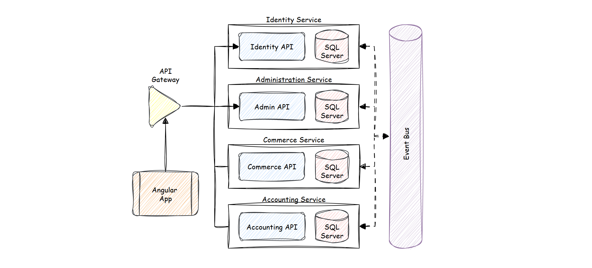

# microservice-boilerplate

An open-source reference app for .NET and microservices that is designed to be deployed using Docker containers. The application consists of multiple subsystems including several front-ends and the back-end microservices.

- **Identity:** Handles authentication and authorization, ensuring secure user access for both tenants and end users with role-based permissions.
- **Administration:** Provides system-wide management and configuration tools, allowing tenants to oversee users, permissions, and operational settings.
- **Commerce:** Facilitates e-commerce capabilities, allowing end users to buy and sell agricultural products while integrating with the traceability system.
- **Accounting:** Manages financial transactions, including tenant billing, payroll, and expense tracking for agricultural companies.

## 🚀 High-level roadmap and milestones

[Detailed roadmap and milestones - generated by AI](/docs/00.roadmap-and-milestones.md)
- [ ] Phase 1: Identity & Multi-Tenancy Setup
- [ ] Phase 2: Frontend Development
- [ ] Phase 3: Deployment Infrastructure
- [ ] Phase 4: CI/CD Pipeline Setup
- [ ] Phase 5: Expand Microservices
- [ ] Phase 6: Optimization & Scaling

## Prerequisties

- Download and install .NET 9.0 SDK
- Prefer using Visual Studio than other IDE
- SQL Server or an other edition of SQL Server
- NodeJS 22.0 for Angular client application